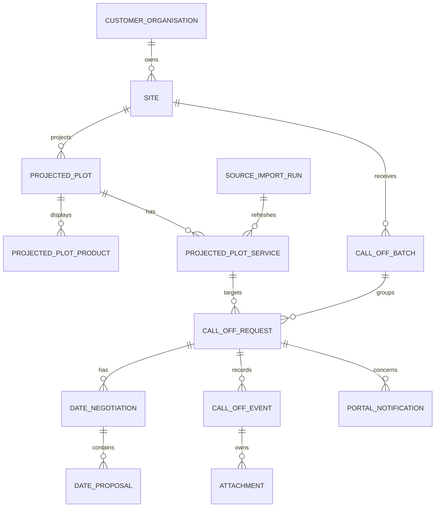
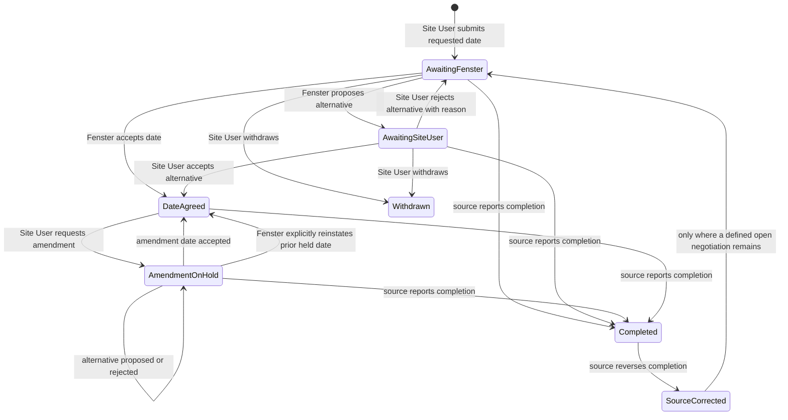

# Management Requirements Gap Analysis — 20 August 2026

**Purpose:** compare the implemented Customer Portal with the management-confirmed target
specification in `context-work-prompt.md` and `brief.md`.

**Scope:** planning and architecture only. This document records the safest implementation
programme; it does not approve code, migrations, screen redesign or Excel integration.

## 1. Executive Assessment

> **Sprint 3A update — 20 August 2026:** the additive schema/access contract described in
> this analysis has been implemented. The authoritative implementation details are in
> `documentation/target-domain-v3.md`. Excel ingestion, dashboard replacement,
> negotiation Actions/UI and amendments remain deferred to their planned sprints.

The current application is a secure, well-tested first call-off workflow, not yet the
management-confirmed Version 1 product. It has a strong access boundary, per-request UUIDs,
transactions, confirmation signatures, immutable history, duplicate prevention, Undo/Trash
operations and in-app notification ownership controls. Those should be preserved.

The largest architectural mismatch is deliberate: the current model treats a batch as one
site + one service + one requested date, then transitions a request through
Submitted/Approved/Rejected/Withdrawn. The target requires four independent services,
many plot/service combinations and dates in one submission, source-driven per-service
completion, and an iterative Date Agreed negotiation/amendment model. That cannot be made
safe by renaming statuses or adding nullable columns to the current batch.

The recommended programme is an additive, non-destructive domain migration. Preserve
legacy rows, UUIDs and event history; introduce a service projection, per-request dates,
negotiation cycles and date proposals; migrate legacy request data; then replace the
dashboard and workflows in dependency order. Do not restart the application or erase
existing development/test records.

## 2. Verified Current Implementation Baseline

| Area | Actual implemented state |
|---|---|
| Authentication | Login, logout, password reset, active-account middleware, no public registration, session/CSRF/rate-limit conventions and development-only role preview are implemented. |
| Roles and organisations | Four Portal roles, customer organisations, sites and many-to-many site assignments exist. The three site roles are distinct but equivalent. |
| Site access | Active-site session middleware and server-side re-authorisation protect Site User browsing and actions. |
| Office Staff scope | Implemented as assigned-site scoped, not global. Review queries, decision eligibility, notification recipients and notification opening all require an assignment. |
| Projected plots | `projected_plots` has UUID, site, external source/identifier, plot reference, whole-plot `is_completed`, source update and synchronisation timestamps. It has no products, service projections, source job stage, completion date, source freshness/absence record or Call No. |
| Services | Enum and validation support only `cavity_closers`, `windows` and `cml`. Snagging is absent. |
| Batches/requests | A batch stores one site, one service, one requested date, one submitter and one message. Requests link only to batch + projected plot and inherit service/date. |
| Current states | `submitted`, `approved`, `rejected`, `withdrawn`. History events mirror those plus Trash/restore/Undo/resubmission. |
| Conflict prevention | A nullable unique `active_conflict_key` is computed by one Action using projected plot + batch service. It protects Submitted and Approved records. |
| History/audit | Append-only per-request history has UUIDs, ordered sequences, before/after JSON, actor, timestamp, customer response and private internal reason. |
| Decisions/resubmission | Office Staff can approve/reject Submitted records. Rejected records can be traceably resubmitted as a new batch/request linked to the rejection. |
| Withdrawal/Trash/Undo | Withdraw, Trash, restore and five-second Undo use transactions, operation/item snapshots and atomic selection rules. Trash is seven-day customer-facing state. |
| Notifications | `portal_notifications` is in-app only, idempotent per recipient/event key and supports read/dismiss. It emits Submitted/Approved/Rejected messages only. |
| Site dashboard | Active-site, paginated call-off card/list view with plot/service/status filters and a small outstanding-plot list. It is not a one-row-per-plot, four-service overview. |
| New Call Off | One service + one date + one or more eligible plots; confirmation HMAC binds the reviewed payload. |
| Office review | Assigned-site review queue with status/site/service filters, request details and approve/reject forms. |
| Attachments | No storage model, relationship, routes, validation or UI. Uppy packages are present but unused by Portal features. |
| Calendar/PDF | No model, route, UI, renderer or schedule export. |
| Excel/SiteApp projection | No adapter, import job, staging, scheduler, source reconciliation or warning mechanism. Source fields are fixture/seed data only. |

The recorded 19 August QA baseline is 118 tests and 632 assertions. This analysis does not
rerun tests because it changes documentation only.

## 3. Requirement Gap Register

| Confirmed requirement | Classification | Gap and required direction |
|---|---|---|
| Four services, including Snagging | Requires database migration and extension | Add `snagging` everywhere a service is enumerated; introduce per-plot service projection rather than treating a service as batch metadata. |
| Plot-centric dashboard | Requires new UI and projection extension | Reuse active-site security, pagination, filters, Portal layout and public UUID routing. Replace card-centric request query with a one-row-per-plot service summary projection. |
| Four independent service states | Requires domain redesign | Current request status cannot represent source completion and negotiation. Derive display from per-service projection plus active request/negotiation state. |
| Multi-plot/multi-service/multi-date submission | Requires domain redesign and migration | Move service, requested date and request message from batch-only ownership to individual requests/initial negotiation. Retain batch as a submission grouping. |
| Date Agreement/alternative loop | Requires domain redesign, migration and new UI | Replace final Approved/Rejected as the current product lifecycle with date negotiations and date proposals. |
| Amendments with On Hold | Requires new entities, migration and new UI | Add an amendment negotiation cycle and preserve prior agreed date rather than overwriting it. |
| Product-driven eligibility and lead time | Requires source projection, new domain service and migration | Current eligibility only checks site, whole-plot completion, enum and conflict. Add per-plot/service product/BF data and a server-side lead-time engine. |
| Request Earlier Date | Requires extension and new UI | Add an explicit exception reason and decision acknowledgement to the negotiation model; not a client-side date override. |
| Source-authoritative completion/reversal | Requires integration and migration | Whole-plot `is_completed` is insufficient. Project completion per service from source job stage/Completed Date and append customer-safe source events. |
| Read-only Excel/SiteApp import | Requires integration | Implement scheduled adapter/import pipeline and source reconciliation; never read Excel during web requests and never write back. |
| Global Fenster Office Staff scope | Requires extension and policy/query migration | Change Office Staff authorization independently of Site User site assignment; update review, gates, decisions and notifications without widening Site User access. |
| Attachments on structured customer actions | Requires migration, storage/security design and UI | Attach files to an immutable action/history record with private storage, malware/content controls and scoped download authorization. |
| Calendar/PDF | Requires new UI and export capability | Build after reliable Date Agreed state exists. Calendar uses Portal data only; PDF is a derived customer-safe schedule. |
| Meaningful in-app/email notifications and reminders | Requires notification extension | Existing ownership/idempotency/read-dismiss model is reusable; notification types, recipients and reminders must be expanded after the new events exist. |
| Company testing only after all requirements | Future programme gate | Current Sprint 2A's permission to start controlled testing is superseded by management's 20 August decision. Do not schedule company testing until final integrated QA passes. |

## 4. What Stays and What Changes

### Keep substantially unchanged

- Laravel authentication, active-account enforcement, disabled registration and development
  preview isolation.
- Customer organisation boundaries for Site Users, assigned-site session re-authorisation
  and UUID strategy.
- Controllers remaining thin and dispatching audited Actions.
- Database transactions, row locking, confirmation signatures and final persistence
  rechecks.
- `active_conflict_key` as a single-owner duplicate-prevention pattern, though its
  calculated inputs and active states must evolve.
- Append-only event history, actor/timestamp attribution and separate customer/private text.
- Operation and operation-item snapshots, atomic Undo/restore and seven-day customer Trash
  behaviour where it remains applicable.
- Notification ownership, idempotent event keys, read/dismiss state and safe failure
  handling.
- Existing Portal layout, active-site site-user navigation, pagination/filter framework and
  non-disclosure of private internal reasons.

### Adapt, do not replace

- `projected_plots`: retain UUID and external identity but evolve from whole-plot
  completion to a plot aggregate over service projections.
- `call_off_batches`: retain as an audited submission-action grouping, but remove the
  requirement that all children share service, date and message.
- `call_off_requests`: retain UUID and request-level identity; give it direct current
  plot-service, date/negotiation and current-state relationships.
- `call_off_status_histories`: preserve existing rows and expand it into the customer-safe
  request event stream; do not rewrite history.
- `DetermineCallOffEligibilityAction`: retain central ownership but delegate date/service
  checks to a dedicated eligibility/lead-time service.
- Review and site dashboards: retain routes/security concepts, replace their projections
  and customer terminology.
- `PortalNotification`: retain the ownership model but evolve fields that assume one
  batch date/status.

### Replace

- The business meaning of `Approved` and `Rejected` as final customer-facing lifecycle
  states. `Date Agreed` and negotiation outcomes become the target.
- The one-service/one-date batch contract.
- The whole-plot `is_completed` eligibility decision as the source of truth for all
  services.
- Any Office Staff query that uses `assignedSites` as a security requirement.
- Rejected-call-off resubmission as the normal way to negotiate a date. Preserve it only
  as legacy data behaviour until a migration/retention policy is approved.

## 5. Obsolete Assumptions Register

| Superseded assumption | Evidence in current implementation/docs | Required treatment |
|---|---|---|
| Three services only | `CallOffServiceType`, migrations, filters, notifications and tests omit Snagging. | Add Snagging through target service projection and regress all enum/validation/filter/notification/history test paths. |
| Batch owns one service and date | `call_off_batches.service_identifier/requested_date`, submission Action and confirmation payload. | Evolve batch into grouping; put operationally meaningful request dates/services on child request/negotiation records. |
| Approved is final customer state | Enum, Actions, review UI, events, notifications and conflict logic use Approved. | Map legacy rows; introduce Date Agreed terminology/state and offer/negotiation records. |
| Rejected triggers resubmission | Reject Action, resubmission controller/Action and DEC-034. | Keep lineage audit but do not use it for alternative-date negotiation. |
| Office Staff must be assigned to a site | `canAccessSite`, ReviewRequestsController, eligibility, gates and notification recipient/query services. | Remove assignment as an Office authorization condition while retaining all Site User constraints. |
| Completed plot cannot receive any new service request | `projected_plots.is_completed` in eligibility. | Use source-driven per-service completion/eligibility. A completed service is ineligible; a partly completed plot remains usable for other eligible services. |
| Dashboard is request-card-centric | SiteDashboardController queries requests as primary records. | Rebuild around plot rows and service summaries. |
| No source integration/attachments/calendar | Code inventory contains none. | Add only after domain/projection contracts are settled. |
| Company testing may begin after Sprint 2A | Current sprint and roadmap say QA passed for controlled testing. | Mark that release gate superseded; complete the management programme first. |

## 6. Target Domain Proposal

### Core entities and responsibilities

| Entity | Responsibility |
|---|---|
| CustomerOrganisation, Site, User, PortalRole, SiteUserAssignment | Retained access boundary. Site assignments apply to Site Users; Office Staff global scope is policy-based. |
| SourceImportRun | Records an idempotent source import attempt, source/version, start/end, status, counts and safe error summary. |
| SourceRecord or SourceProjectionIssue | Tracks source identity, last seen/imported state and missing/invalid record warnings without exposing operational details to customers. |
| ProjectedPlot | Customer-safe plot identity and aggregate display attributes. Retains UUID/external identity; Full Completion is derived from its services. |
| ProjectedPlotProduct | Customer-visible product code/quantity per projected plot, retaining only approved display data. |
| ProjectedPlotService | One row per plot/service. Holds service identifier, source call number/call type, product/BF eligibility inputs, source job stage snapshot, source completion date and last source observation. This is the target of a call-off. |
| CallOffBatch | One user submission action for one active site. Groups child requests and bulk operation audit; it does not impose a single service/date. |
| CallOffRequest | Persistent customer request identity for one projected plot service, current state, current agreed date, submitter and current active negotiation. |
| DateNegotiation | One initial or amendment cycle for a request. Records purpose, state, original request/exception reason, prior agreed date held during amendment and closure reason. |
| DateProposal | Ordered offers inside a negotiation: customer requested date or Fenster alternative; proposer, date, response, response reason, lead-time exception flags and timestamps. |
| CallOffEvent (evolved history) | Immutable customer-safe/audit event stream for submissions, proposals, accepts/rejects, withdrawals, amendments, completion/reversal, operations and migration mapping. |
| CallOffBatchOperation / Item | Retained atomic user-operation audit for eligible selections. Expand only after deciding which new lifecycle actions are Trash/Undo eligible. |
| Attachment | Private customer file attached to a structured action/event, with uploader, storage key, original filename, media type, byte size, checksum, validation/scan state and timestamps. |
| PortalNotification | Retained recipient-owned event notification. Store a generic target/event reference or sufficient immutable snapshot, not only the old request date/status assumptions. |
| ReminderSchedule or queued reminder job | Idempotently schedules one-week and one-working-day Date Agreed reminders against an agreed proposal/request; completion/withdrawal/amendment cancels or suppresses them. |

### Relationships



### Target request and negotiation states

The exact enum names are an implementation contract to settle in Sprint 3A, but the
business states should be represented independently from proposal responses:



Do not model the alternative loop as nullable `proposed_date_2`,
`proposed_date_3` columns. DateProposal rows preserve order, actor, reasons and
concurrency semantics. A DateNegotiation uses a nullable unique active key (or equivalent
MySQL-safe constraint) so one request cannot have two open initial/amendment cycles.

### Concurrency and conflict rules

- Lock the request, active negotiation and relevant plot-service row before accepting,
  proposing, withdrawing, amending or applying source completion.
- Bind confirmation signatures to request UUID, current negotiation/proposal UUID,
  acting user, active site where applicable, date, reason and source version/lock token.
- Retain the unique conflict-key pattern, but calculate it from projected plot service.
  A request remains conflict-active while it has an open negotiation, Date Agreed or an
  On Hold amendment. Source-completed services are separately ineligible for new requests.
- A source completion update wins over open negotiation/amendment: close it with a
  source-completion event rather than silently deleting proposals.
- An old proposal cannot be accepted after a newer proposal or state change; use row locks
  and a state/version check.

## 7. Non-Destructive Data Migration Strategy

1. **Inventory and backup first.** On production, record counts/checksums by table,
   take a tested backup and rehearse against a masked copy. Do not use
   `migrate:fresh`, truncate or transform history in place.
2. **Additive schema.** Add plot-service, product, import, negotiation/proposal and
   attachment/event-support tables. Add new nullable columns/indexes to existing rows;
   do not drop old batch/date/status columns in the first release.
3. **Backfill services.** Create one ProjectedPlotService for every existing request using
   its legacy batch service. Add Snagging only as a new valid service; no legacy value
   needs coercion.
4. **Backfill request values.** Copy legacy batch service/date/message snapshots to each
   child request or create a completed legacy initial negotiation/proposal. Preserve the
   source batch values unchanged for audit and rollback.
5. **Map old states explicitly.** Submitted becomes an open legacy initial negotiation;
   Approved becomes Date Agreed with the approved date as the accepted proposal; Withdrawn
   remains Withdrawn. Legacy Rejected must remain visible/auditable as a legacy terminal
   outcome, not be rewritten as a rejected alternative. Record a migration event with
   source status and mapping version.
6. **Preserve lineage and operations.** Keep
   `resubmitted_from_call_off_request_id`, history sequences, operation/item snapshots,
   Trash timestamps, notification rows and public UUIDs. Do not change existing UUIDs.
7. **Dual-read transition.** Release read models that can present both mapped legacy
   records and new negotiation records. Keep legacy columns until all records are
   backfilled, verified and a separate retirement decision is approved.
8. **Recalculate safely.** Rebuild conflict keys from the new plot-service identity inside
   a transaction/reconciliation command. Detect duplicates before applying uniqueness.
9. **Validate in SQLite and MySQL.** Rehearse forward migration, rollback plan, data
   assertions, row counts, UUID uniqueness, indexes, lock races and tenant isolation. A
   rollback after customer activity must be a forward compensating plan, not destructive
   schema rollback.
10. **Cutover only with evidence.** Compare pre/post counts, sample every legacy status,
    verify history visibility/private-reason separation and test source-completion
    precedence before enabling new UI routes.

## 8. Ordered Implementation Programme

### Sprint 3A — Target Domain and Access Migration Contract

- **Purpose:** settle the new state vocabulary and produce/rehearse the additive migration
  contract.
- **Backend:** migration design for plot services/products, request-level fields,
  negotiations/proposals and source import audit; global Office Staff authorization
  boundary; legacy mapping plan.
- **UI:** no production redesign; only contract-level route/view inventory.
- **Tests:** migration/backfill fixtures for all legacy statuses, tenant/Office scope,
  UUID/history preservation, unique active negotiation and conflict-key races.
- **Prerequisites:** Product confirms the state names and legacy rejected-record treatment.
- **Exclusions:** Excel ingestion, dashboard rewrite, attachments and calendar.
- **QA gate:** SQLite and MySQL rehearsal with verified non-destructive backfill and
  downgrade/forward-recovery plan.

### Sprint 3B — Source Projection and Service Eligibility Foundation

- **Purpose:** establish a safe scheduled source projection before exposing the new model.
- **Backend:** import adapter contract, SourceImportRun/issues, projected plot services,
  products, Call No./call-type mapping, completion mappings, missing-record retention and
  freshness fields.
- **UI:** source freshness/absence presentation contract only; no Excel file read in web
  requests.
- **Tests:** idempotency, malformed/duplicate source records, missing-source retention,
  CC08/CA02/CA03/SN05/CML4 and Completed Date precedence/reversal.
- **Prerequisites:** Sprint 3A migration contract and approved source sample/schema.
- **Exclusions:** live production credentials, dashboard redesign, call-off negotiation.
- **QA gate:** fixture import repeatedly produces identical projection; source completion
  never leaks operational details.

### Sprint 3C — Lead-Time and Eligibility Engine

- **Purpose:** make per-plot/service eligibility authoritative before new submissions.
- **Backend:** LeadTimePolicy/Calendar service, UK bank-holiday provider/data contract,
  BF detection from projection, six-month/weekday rules, earlier-date exception decision
  inputs and revised conflict-key owner.
- **UI:** date availability/error contract only.
- **Tests:** standard/BF dates, differing plots in one selection, weekends, bank holidays,
  six-month limit, completed service and duplicate blocking.
- **Prerequisites:** Sprint 3B service/product projection.
- **Exclusions:** full New Call Off redesign and Office negotiation UI.
- **QA gate:** deterministic clock/holiday tests and server-only validation across all
  entry points.

### Sprint 3D — Plot-Centric Overview

- **Purpose:** replace the request-card dashboard with the required plot/service overview.
- **Backend:** server-authorised plot-row projection, aggregate overall-status calculation,
  completed-row filter and scalable pagination/filtering.
- **UI:** one plot per row; four ordered service cells; accessible status labels/icons;
  Show Completed; Plot Details entry point.
- **Tests:** overall-status precedence, full completion retained/hidden, active-site and
  cross-tenant filters, 320px/tablet/desktop layout.
- **Prerequisites:** Sprint 3B service projection.
- **Exclusions:** final submission flow, file upload and calendar.
- **QA gate:** projection has no N+1 regression and presents legacy mapped records safely.

### Sprint 3E — Multi-Plot/Multi-Service New Call Off

- **Purpose:** support one submission action with selected plot/service combinations and
  individual requested dates.
- **Backend:** request-level submission Action, batch grouping update, review signature,
  per-combination eligibility and history/event creation.
- **UI:** row and bulk Call Off routes, combination matrix with disabled explanations,
  date per service/plot as required, explicit earlier-date route and review/confirmation.
- **Tests:** mixed services/dates, exclusion of individual combinations, partial
  eligibility feedback without silent removal, tampering, atomic persistence and
  independent conflict races.
- **Prerequisites:** Sprint 3C and target dashboard contracts.
- **Exclusions:** alternative-date responses and amendments.
- **QA gate:** existing legacy submission and new multi-service submission coexist without
  data loss.

### Sprint 3F — Date Negotiation and Office Review

- **Purpose:** implement Accept Date and iterative alternative-date negotiation.
- **Backend:** negotiation/proposal Actions, request state transitions, proposal locking,
  global Office scope, notification domain events and legacy decision presentation.
- **UI:** global Office review queue, proposal detail/action screens and Site User accept/
  reject-alternative screens with mandatory rejection reason.
- **Tests:** all loop transitions, stale proposal rejection, global Office access,
  Site User assigned-site boundary, private reasons, conflict persistence and source
  completion race.
- **Prerequisites:** Sprint 3A/3E.
- **Exclusions:** amendments, attachments, calendar and email delivery.
- **QA gate:** a complete initial request-to-Date-Agreed journey passes at browser level.

### Sprint 3G — Amendments and Source Completion Reconciliation

- **Purpose:** add post-agreement amendments and make source completion authoritative.
- **Backend:** amendment negotiation type, On Hold prior-date snapshot, late-amendment
  calculation, explicit reinstatement Action, source completion/reversal Actions and
  event histories.
- **UI:** amendment request/review, On Hold display, explicit reinstatement outcome and
  completion/reversal history.
- **Tests:** three-working-day flag, no automatic reinstatement, completion closing open
  work, reversal display, no manual staff completion and audit integrity.
- **Prerequisites:** Sprint 3F and Sprint 3B.
- **Exclusions:** attachments, calendar/PDF and reminder delivery.
- **QA gate:** source completion wins every open-state race and never erases negotiation
  history.

### Sprint 3H — Structured Attachments

- **Purpose:** add secure evidence/documents to defined customer actions.
- **Backend:** Attachment model/relationship to event, private disk, allow-list, size
  limit, checksum, scan/quarantine contract, scoped download authorization and retention.
- **UI:** optional upload/review on the approved structured actions; customer-safe history
  display.
- **Tests:** role ownership, site/org isolation, content/type/size validation, no public
  storage URLs, failed upload cleanup and private-reason non-disclosure.
- **Prerequisites:** stable action/event model from Sprint 3F/3G and approved storage/
  malware scanning platform decision.
- **Exclusions:** general document library and Fenster-upload flow.
- **QA gate:** security review of download paths and storage lifecycle passes.

### Sprint 3I — Notifications and Reminders

- **Purpose:** extend the existing notification domain to meaningful new events.
- **Backend:** notification types/recipients for proposals, agreement, amendments and
  earlier-date exceptions; queue-safe/idempotent email mapping; one-week and one-working-
  day reminders; cancellation/suppression on completion/withdrawal.
- **UI:** revised notification copy/links and notification-centre context.
- **Tests:** recipient ownership, global Office scope, no completion notification,
  duplicate/reminder suppression, read/dismiss retention and failed delivery isolation.
- **Prerequisites:** Sprint 3F/3G state/event contracts and mail/queue environment plan.
- **Exclusions:** push/SMS and preference centre unless separately approved.
- **QA gate:** event-to-recipient matrix and time-based reminder tests pass with a frozen
  clock.

### Sprint 3J — Calendar and PDF Schedules

- **Purpose:** present agreed work without importing operational schedules.
- **Backend:** Date Agreed-only calendar query, safe filters and branded schedule export
  service.
- **UI:** one-site calendar, service colours plus accessible labels, mobile summary/View
  Details and week/month PDF choice.
- **Tests:** Date Agreed-only inclusion, customer/site isolation, no product quantities in
  PDF, timezone/date correctness, accessibility and large-data pagination/export bounds.
- **Prerequisites:** reliable Date Agreed state from Sprint 3F and service display model.
- **Exclusions:** operational planned dates, source placeholders and write-back.
- **QA gate:** generated schedules match Portal agreement records exactly.

### Sprint 3K — Integrated QA and Company-Test Preparation

- **Purpose:** prove the complete management-confirmed Version 1 product before testing.
- **Backend/UI:** defect correction only; no new scope.
- **Tests:** full regression, MySQL migration/concurrency/backfill rehearsal, source-import
  fixtures, attachment storage/security, queue/reminders, accessibility and responsive
  browser suite.
- **Prerequisites:** all prior sprints and production-like non-secret platform fixtures.
- **Exclusions:** production deployment and post-test feature requests.
- **QA gate:** fictional customer/site acceptance script passes without developer help;
  management approves presentation; no serious integrity/security defect remains.

## 9. Parallel and Sequential Work

| Workstream | Safe parallel work | Must wait |
|---|---|---|
| Programme/Product | State glossary, legacy mapping decision, CML expansion, amendment reasons, company-test script and acceptance criteria. | Must approve Sprint 3A before schema work and source-field mapping before 3B. |
| Backend | Sprint 3A migration spike and 3B adapter interfaces after contracts; test-fixture builders. | Do not build negotiation, submissions or UI endpoints against the old batch contract. |
| UI | Plot-dashboard design/prototype, service status language, matrix interaction and calendar/PDF visual requirements using static contract fixtures. | Do not bind production UI to requests/proposals before Sprint 3A–3C contracts settle. |
| QA | Legacy-data matrix, migration assertions, source fixtures, lifecycle/state matrix and accessibility test plan. | End-to-end workflow tests wait for each corresponding action/UI sprint. |
| Platform/Integration | Source sample/data dictionary, import transport/security proposal, MySQL rehearsal environment, private attachment storage/scan options, queue/mail/reminder plan. | No live source connection or credentials before source contract and least-privilege review. |

Critical sequential path:

```text
3A domain/access contract
  → 3B source projection
  → 3C eligibility engine
  → 3D overview + 3E submission
  → 3F negotiation
  → 3G amendments/completion
  → 3H attachments + 3I notifications + 3J calendar/PDF
  → 3K integrated QA/company-test preparation
```

Sprints 3H, 3I and 3J may overlap after their respective event and Date Agreed contracts
are stable, but must merge behind those contracts and a shared regression gate.

## 10. Company-Test Target and Risks

Company testing must not begin halfway through this programme. The final gate uses a
fictional customer/site and dummy plots. Testers are at least one Fenster staff member and
two or three representatives of the external Site User roles.

Acceptance requires that participants complete the main workflows without developer help,
understand the terminology and workflow, find no serious bug/data-integrity issue, and
receive management approval for the finished presentation.

Primary risks:

1. **Legacy data semantics:** old Approved/Rejected rows cannot be silently reinterpreted.
2. **Scope leakage:** source mappings must stay customer-safe and never import SiteApp
   workflow/planning data.
3. **Global Office scope:** a policy change can accidentally weaken Site User tenant/site
   isolation if authorization is not role-specific.
4. **MySQL constraints/concurrency:** SQLite success is insufficient for unique active
   states, row locks and backfills.
5. **Source quality/freshness:** missing/late/duplicated source records need import
   reconciliation without hiding known customer data.
6. **Lead-time calendar correctness:** bank holiday and working-day rules require a tested
   owned data source/contract.
7. **Attachments:** storage, scan, content validation and access controls require platform
   decisions before implementation.
8. **Notification noise:** reminder idempotency and cancellation are essential once events
   and completion reversals exist.

## 11. Remaining TBC Items

- Exact customer-facing expansion of CML.
- Predefined amendment-reason categories.
- Owner and operating process for Excel/source updates.
- Detailed source transport, credentials and reconciliation contract.
- UK bank-holiday data source and maintenance ownership.
- Bulk submission size/interaction limits.
- Long-term retention beyond the seven-day Trash window.
- Migration presentation/retention policy for historic direct rejected call-offs.
- Attachment size/type/virus-scanning and retention policy.
- Email sender, queue, deliverability and reminder escalation policy.

## Recommendation

**First implementation sprint: Sprint 3A — Target Domain and Access Migration Contract.**

Send the first implementation task to the **Backend chat**. It should implement only the
approved additive schema/access migration spike and its MySQL/SQLite data-preservation
tests after Product has frozen the target state glossary and legacy mapping rules.
